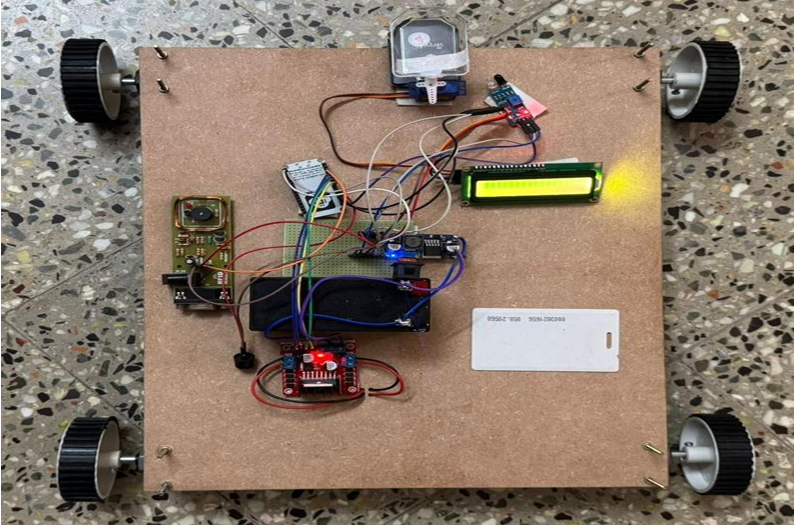
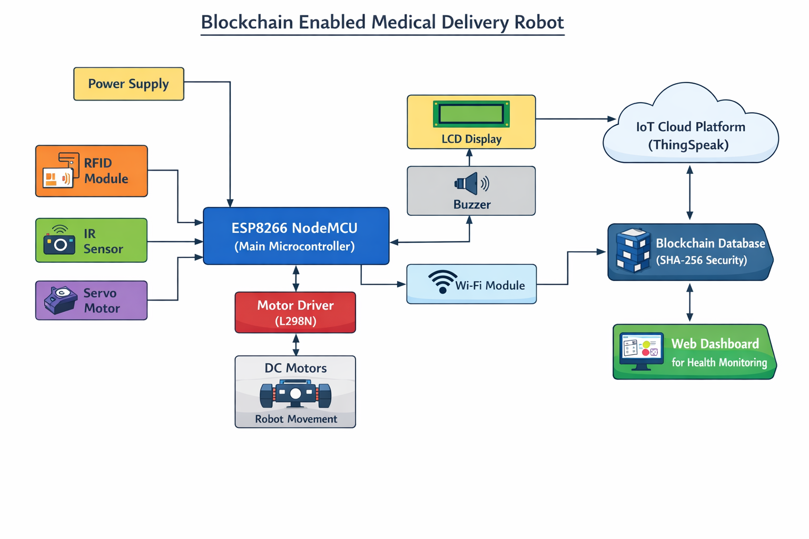
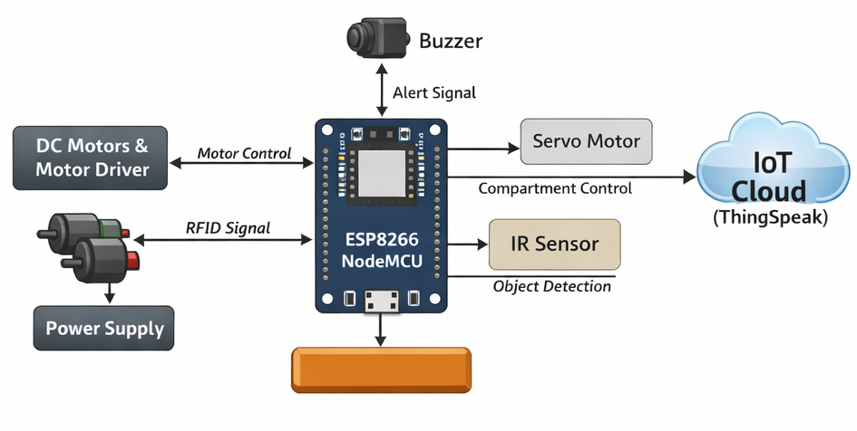
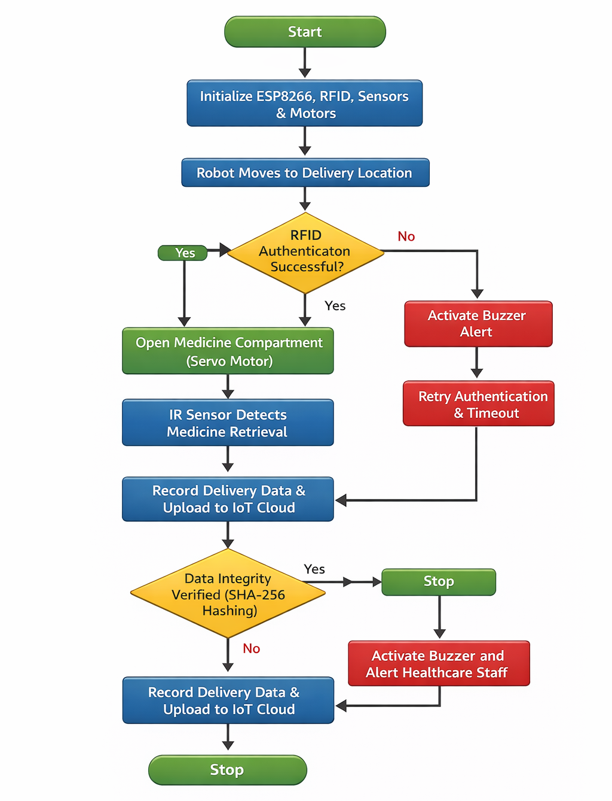
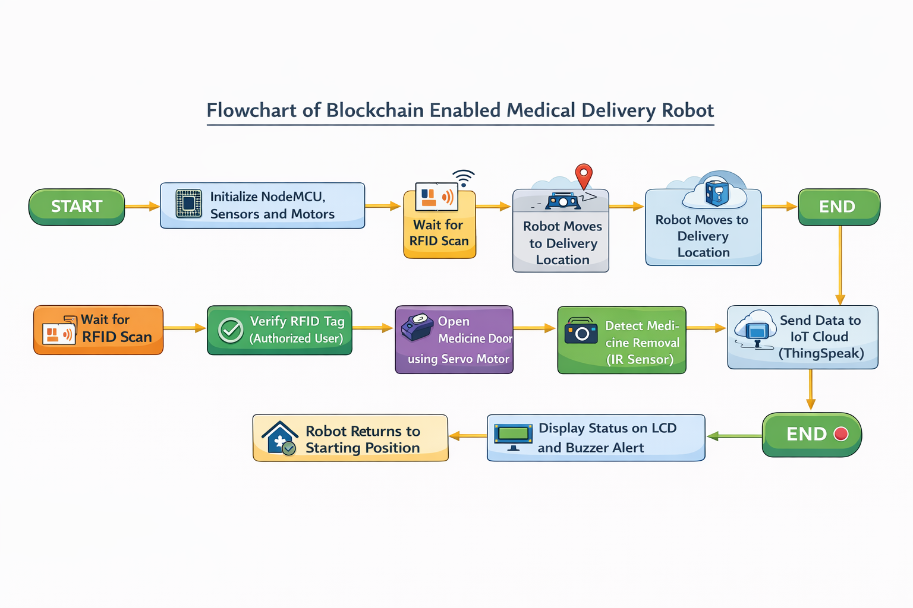
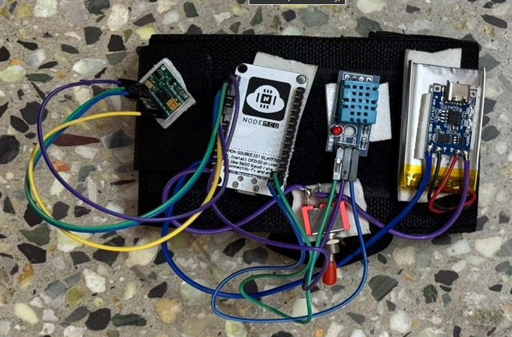
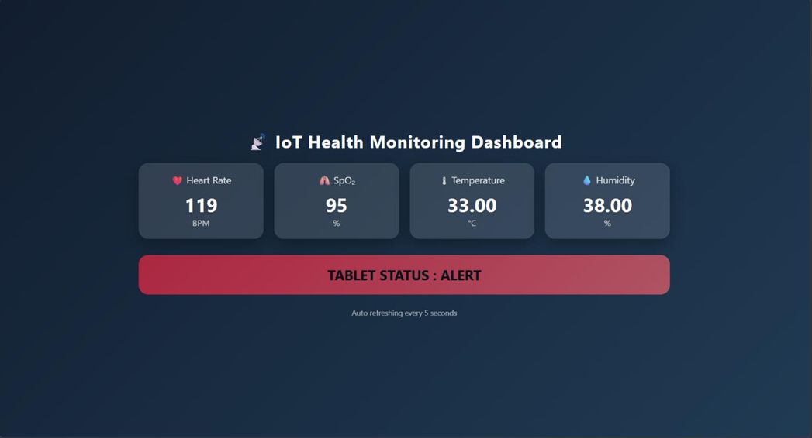
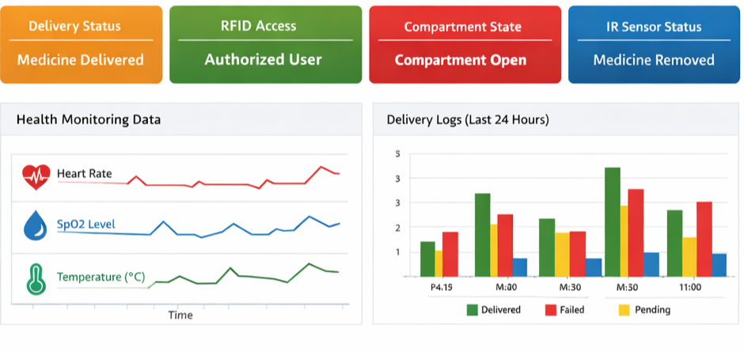
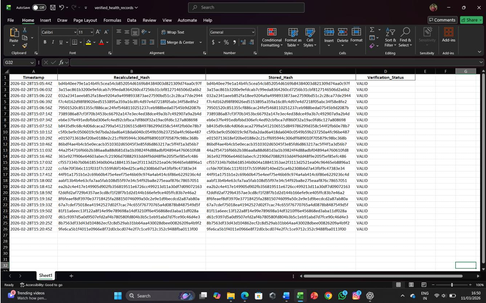

<!-- ===================================================== -->
<!--                     PROJECT HEADER                    -->
<!-- ===================================================== -->

<h1 align="center">
🤖 Blockchain-Enabled Secure Medical Delivery Robot
</h1>

<h3 align="center">
Secure IoT-Based Healthcare Automation System
</h3>

<p align="center">


</p>

---

<p align="center">



</p>

<p align="center">

<b>Secure • Intelligent • Autonomous • Blockchain Inspired • IoT Enabled</b>

</p>

---

# 🌍 Project Overview

Healthcare automation has become increasingly important for improving efficiency, reducing human intervention, and ensuring secure medicine delivery. This project introduces a **Blockchain-Enabled Secure Medical Delivery Robot** designed to automate medicine transportation inside hospitals using **IoT technologies**.

The robot authenticates users through **RFID**, verifies medicine collection using an **IR sensor**, and secures every delivery record using **SHA-256 hashing**, ensuring data integrity. Real-time monitoring is performed through the **ThingSpeak Cloud Platform** and a custom **Web Dashboard**, providing healthcare professionals with live delivery updates.

This project demonstrates the integration of **Embedded Systems**, **IoT**, **Cloud Computing**, and **Cybersecurity** into a practical healthcare solution.

---

# ⭐ Highlights

<table>

<tr>

<td width="50%">

### 🔐 Secure Authentication

- RFID Verification
- Authorized Access
- Patient Validation

</td>

<td width="50%">

### 🤖 Autonomous Delivery

- Intelligent Navigation
- Automated Medicine Transport
- Contactless Delivery

</td>

</tr>

<tr>

<td width="50%">

### ☁️ Cloud Integration

- ThingSpeak Dashboard
- Real-Time Monitoring
- Live Status Updates

</td>

<td width="50%">

### 🔒 Data Security

- SHA-256 Encryption
- Secure Record Storage
- Delivery Verification

</td>

</tr>

</table>

---

# ✨ Key Features

✅ RFID-Based Authentication

✅ Autonomous Medicine Delivery

✅ Servo Controlled Medicine Compartment

✅ IR Sensor Retrieval Verification

✅ Real-Time IoT Monitoring

✅ ThingSpeak Cloud Integration

✅ SHA-256 Data Integrity

✅ Web Dashboard

✅ Embedded ESP8266 Controller

---

# 🛠 Technology Stack

| Category | Technology |
|-----------|------------|
| Microcontroller | ESP8266 NodeMCU |
| Programming Language | Embedded C/C++ |
| IDE | Arduino IDE |
| Cloud Platform | ThingSpeak |
| Security | SHA-256 |
| Frontend | HTML, CSS, JavaScript |
| Sensors | RFID, IR Sensor |
| Motor Driver | L298N |
| Actuator | Servo Motor |

---

# 📦 Hardware Components

| Component | Purpose |
|-----------|----------|
| ESP8266 NodeMCU | Main Controller |
| RFID Module | User Authentication |
| IR Sensor | Medicine Detection |
| Servo Motor | Box Lock Mechanism |
| L298N | Motor Control |
| DC Motors | Robot Movement |
| Chassis | Robot Body |
| Wi-Fi | Cloud Communication |

---

# 📑 Table of Contents

- 🏗 System Architecture
- 🔄 Workflow
- 🔧 Hardware Design
- 🌐 Cloud Dashboard
- 📊 Results
- 📂 Repository Structure
- 🚀 Installation
- 🎯 Applications
- 🚀 Future Scope
- 👨‍💻 Author

---

<!-- ===================================================== -->
<!--                 SYSTEM ARCHITECTURE                   -->
<!-- ===================================================== -->

# 🏗️ System Architecture

The proposed system integrates **Embedded Systems**, **IoT**, **Cloud Computing**, and **Blockchain-inspired Security** to automate secure medicine delivery within smart healthcare environments.

---

## 📌 Overall Block Diagram

<p align="center">

</p>

> **Description**
>
> The ESP8266 NodeMCU acts as the central controller, interfacing with RFID, IR sensor, motor driver, servo motor, Wi-Fi, and the ThingSpeak cloud platform.

---

## 📌 Functional Block Diagram

<p align="center">

</p>

> **Description**
>
> The robot authenticates the user using RFID, unlocks the medicine compartment via the servo motor, verifies medicine collection using the IR sensor, and securely uploads delivery records to the cloud.

---

# 🔄 System Workflow

## 📈 Software Flowchart

<p align="center">

</p>

---

## 🔁 Delivery Process Flow

<p align="center">

</p>

---

### ⚙️ Operational Workflow

```text
Start
   │
   ▼
Initialize ESP8266
   │
   ▼
Connect to Wi-Fi
   │
   ▼
Scan RFID Card
   │
   ▼
Authorized?
   │
Yes ──────────────► Unlock Medicine Box
   │                     │
   │                     ▼
   │              Medicine Removed?
   │                     │
   │                   Yes
   │                     │
   ▼                     ▼
Generate SHA-256 Hash
   │
   ▼
Upload to ThingSpeak
   │
   ▼
Update Dashboard
   │
   ▼
End
```

---

# 🔧 Hardware Design

## 🤖 Hardware Prototype

<p align="center">

</p>

---

## 🔌 Sensor Integration

<p align="center">

</p>

---

### 📋 Hardware Specifications

| Component | Specification |
|-----------|---------------|
| Controller | ESP8266 NodeMCU |
| RFID | RC522 Module |
| Motion | DC Motors |
| Motor Driver | L298N |
| Lock Mechanism | Servo Motor |
| Detection | IR Sensor |
| Communication | Wi-Fi |
| Cloud | ThingSpeak |

---

# ☁️ Cloud Monitoring

Real-time monitoring is performed using the **ThingSpeak IoT Platform**.

The dashboard displays:

- 📡 Robot Status
- 🔐 Authentication Status
- 📦 Medicine Delivery Status
- 🌐 Wi-Fi Connectivity
- ⏱ Timestamp
- 📊 Live Sensor Data

---

## 📊 ThingSpeak Dashboard

<p align="center">

</p>

---

# 💻 Web Dashboard

A responsive web interface provides healthcare professionals with a centralized monitoring dashboard.

### Dashboard Features

✅ Live Delivery Status

✅ RFID Authentication Log

✅ Delivery History

✅ Medicine Verification

✅ Cloud Synchronization

---

<p align="center">

</p>

---

# 📷 Project Gallery

<table>

<tr>

<td align="center">


### 🤖 Robot Prototype

</td>

<td align="center">


### ☁️ ThingSpeak Dashboard

</td>

</tr>

<tr>

<td align="center">


### 🏗 Functional Design

</td>

<td align="center">


### 💻 Web Dashboard

</td>

</tr>

</table>

---

<!-- ===================================================== -->
<!--                  PROJECT RESULTS                      -->
<!-- ===================================================== -->

# 📊 Experimental Results

The proposed system was successfully implemented and tested in a real-time laboratory environment.

<p align="center">

</p>

---

## 📈 Performance Summary

| Module | Status | Description |
|---------|:------:|-------------|
| RFID Authentication | ✅ | Successfully authenticates authorized users |
| Servo Control | ✅ | Opens and locks medicine compartment |
| IR Verification | ✅ | Detects successful medicine retrieval |
| Robot Navigation | ✅ | Autonomous movement completed |
| SHA-256 Security | ✅ | Generates secure delivery hash |
| ThingSpeak Cloud | ✅ | Uploads delivery information in real time |
| Web Dashboard | ✅ | Displays delivery and authentication status |

---

# 🚀 Getting Started

## 📋 Hardware Requirements

- ESP8266 NodeMCU
- RFID RC522 Module
- IR Sensor
- Servo Motor
- L298N Motor Driver
- DC Motors
- Robot Chassis
- Battery Pack
- Jumper Wires

---

## 💻 Software Requirements

- Arduino IDE
- ESP8266 Board Package
- ThingSpeak Account
- HTML, CSS & JavaScript
- Git

---

## ⚙️ Installation

### Clone the repository

```bash
git clone https://github.com/Devak29/Blockchain-Enabled-Secure-Medical-Delivery-Robot.git
```

### Open Arduino IDE

- Install ESP8266 Board Package
- Install required libraries
- Update Wi-Fi credentials
- Configure ThingSpeak API Keys

### Upload

Compile and upload the code to the ESP8266 NodeMCU.

---

# 📂 Repository Structure

```text
Blockchain-Enabled-Secure-Medical-Delivery-Robot
│
├── README.md
├── LICENSE
├── docs
│   └── IEEE Paper 8th Sem.pdf
│
├── images
│   ├── block-diagram.png
│   ├── functional-block-diagram.png
│   ├── flow-diagram.png
│   ├── software-flowchart.png
│   ├── hardware-prototype.png
│   ├── iot-sensor.png
│   ├── thingspeak-dashboard.png
│   ├── web-dashboard.png
│   └── verification-result.png
│
├── source
│   ├── main.ino
│   ├── RFID.ino
│   ├── Motor.ino
│   ├── WiFi.ino
│   └── SHA256.ino
│
└── hardware
```

---

# 🎯 Applications

| Domain | Application |
|--------|-------------|
| 🏥 Smart Hospitals | Automated medicine delivery |
| 💊 Pharmacy Automation | Secure medicine transportation |
| 👴 Elderly Care | Contactless medicine distribution |
| 🚑 Emergency Healthcare | Rapid medical logistics |
| 🌐 IoT Healthcare | Smart monitoring systems |

---

# 🚀 Future Enhancements

- 🤖 AI-Based Navigation
- 📍 GPS Tracking
- 📱 Android/iOS Mobile Application
- ☁️ Firebase Cloud Integration
- 📷 QR Code Authentication
- 🧠 Machine Learning-Based Route Optimization
- 🔋 Battery Health Monitoring
- 📊 Predictive Analytics Dashboard

---

# 📚 Research Contribution

This project was developed as part of an academic research initiative focusing on the integration of **Embedded Systems**, **Internet of Things (IoT)**, and **Blockchain-inspired Security** for healthcare automation.

### Research Areas

- Embedded Systems
- Internet of Things (IoT)
- Smart Healthcare
- RFID Authentication
- Cloud Computing
- SHA-256 Security
- Autonomous Robotics

---

## 👨‍💻 Author

**Devak G.K**  
Electronics & Communication Engineering Graduate

📧 gkdevak@gmail.com  
💻 https://github.com/Devak29  
💼 https://www.linkedin.com/in/devak-g-k

<a href="https://github.com/Devak29">

</a>

<a href="https://www.linkedin.com/in/devak-g-k">

</a>

</div>

---

# 📄 License

This project is intended for **academic, educational, and research purposes**.

---

<div align="center">

# ⭐ Support This Project ⭐

If you found this repository useful or inspiring,

please consider giving it a ⭐ on GitHub.

---

### Thank You for Visiting!

*"Engineering secure healthcare solutions through Embedded Systems, IoT, and Intelligent Automation."*
